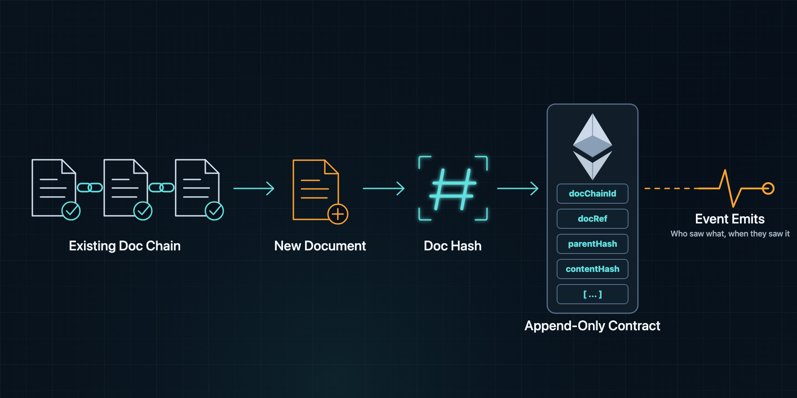

# Doc Chain Attestation Protocol



A generic Ethereum witness protocol for attestation-driven document chains.

Document Chain provides the reusable rail:

- a minimal append-only Ethereum contract
- a `DocBlock` model with parent-hash linkage
- EIP-712 typed attestations
- EOA and EIP-1271 signature support
- contract-level deadlines and duplicate prevention
- neutral event model helpers
- vendorable stdlib-only reference code

Projects such as the om.pub RSO Archive define their own `docChainId` profile:

- what `contentHash` means
- how documents are canonicalized
- how parentage is validated
- which attestations are eligible
- how competing branches are scored

Document Chain does **not** define one universal consensus mechanism. It
publishes signed, timestamped claims. Each document chain supplies its own
validation and canonicality rules.

Start with [docs/protocol.md](docs/protocol.md) for the contract boundary,
typed-data model, event semantics, and profile responsibilities.

## Repository Layout

```text
contracts/          Ethereum contract source
docs/               protocol and integration docs
reference/          stdlib-only event models and ABI constants
```

## Core Model

```solidity
struct DocBlock {
    bytes32 docChainId;
    uint64 docRef;
    bytes32 parentHash;
    bytes32 contentHash;
}

struct DocumentAttestation {
    address attester;
    DocBlock docBlock;
    string uri;
    uint256 deadline;
}
```

The contract computes `blockHash` from `DocBlock`. Because `parentHash` is part
of the hashed block, changing any historical block changes every descendant
block hash. `docRef` is the profile-defined reference used for grouping,
browsing, and querying blocks; `blockHash` is identity and `parentHash` is
ancestry.

## Reuse Model

Production projects should vendor the small `reference/docchain` module into
their own repository instead of installing it at runtime. This keeps operators
dependency-free and reviewable.

```text
vendor/docchain/
  VERSION
  abi.py
  model.py
```

Profile-specific code lives in the consuming project.
